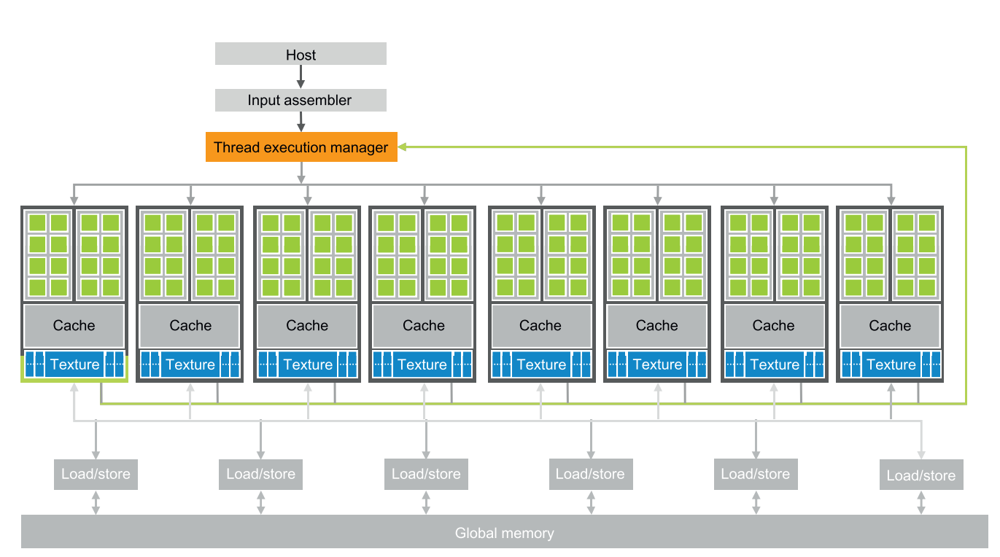
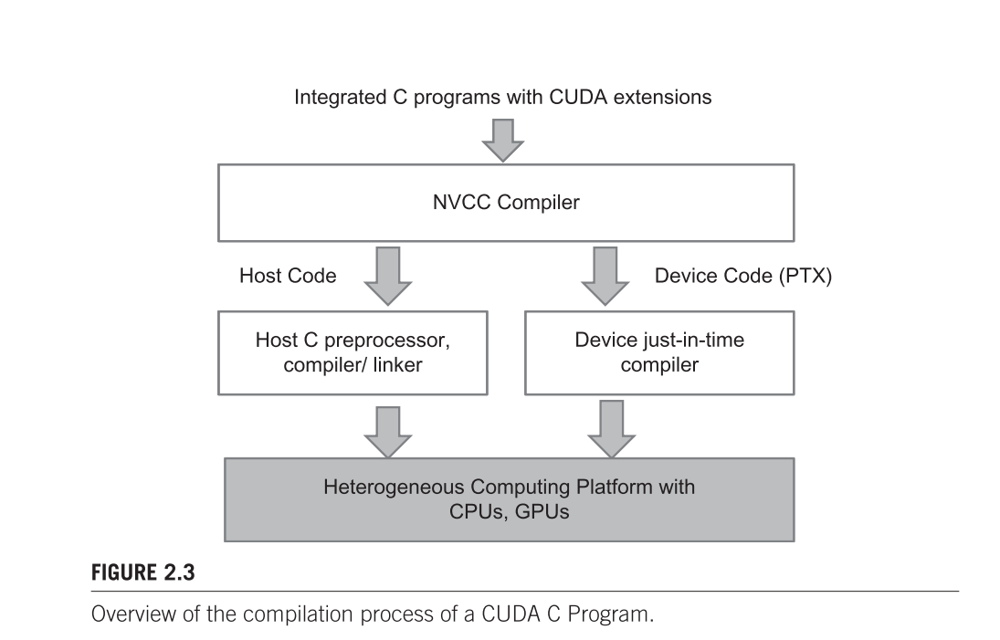
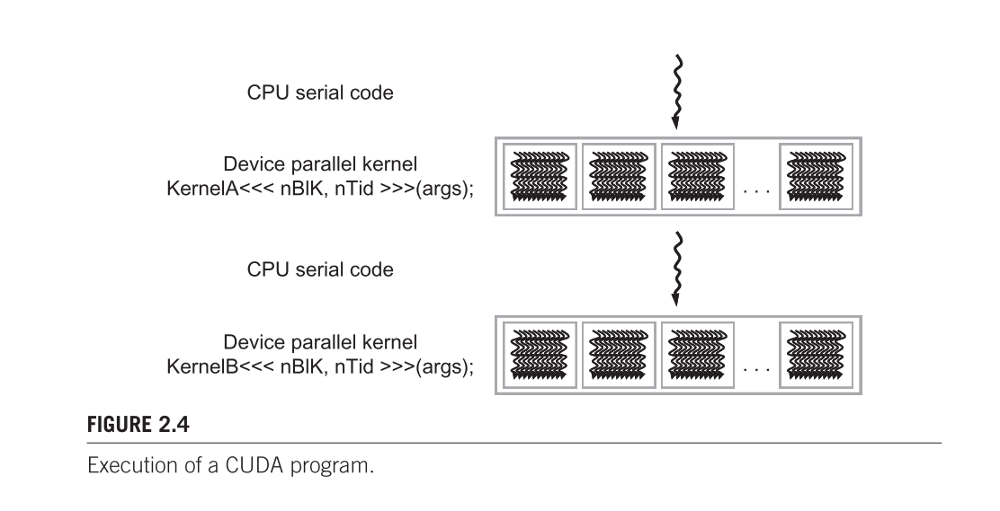
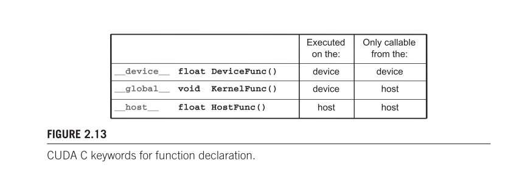
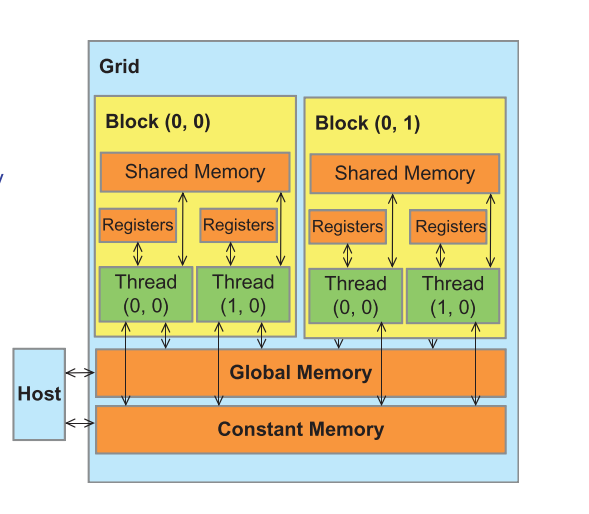
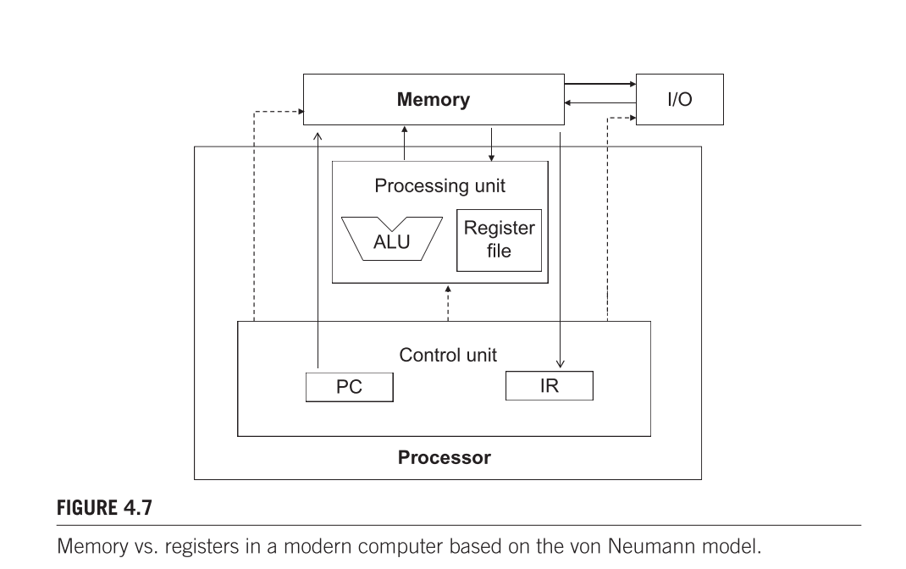

# **Programming Massively Parallel Processor NOTES**

## **GPU structure**

- **Terminology：**
  - Streaming Multiprocessors (SMs) - BLOCK
  - Streaming Processors (SPs) - THREAD
  - Synchronous DRAM (SDRAM) - Global MEM
  - Graphics Double Data Rate (GDDR) - GDDR SRAMs(used for graphics)
  - High-Bandwidth Memory (HBM)
  - Single Instruction Multiple Data (SIMD)

## CUDA compliation

- NVIDIA C Complier(NVCC)
  

## **Memory and data locality**

- Registers (thread R/W)
- Local Memory (thread R/W)
- Shared Memory / Scratchpad memory (block R/W)
- Global Memory (grid R/W)
- Constant Memory (grid R only)
  

- arithmetic and logic unit (ALU)

