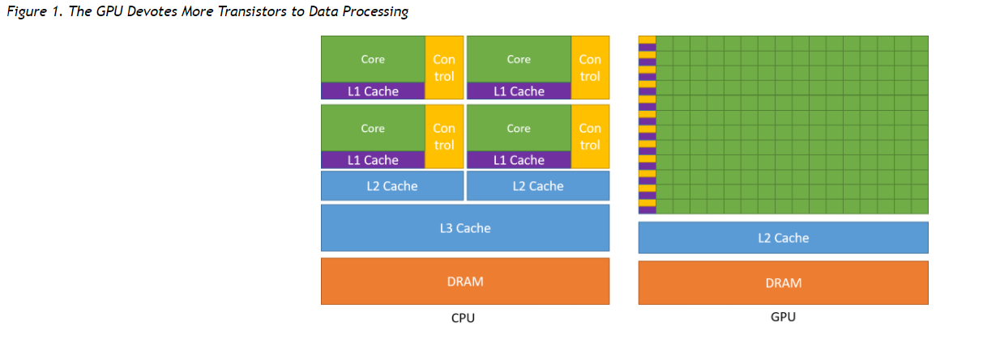
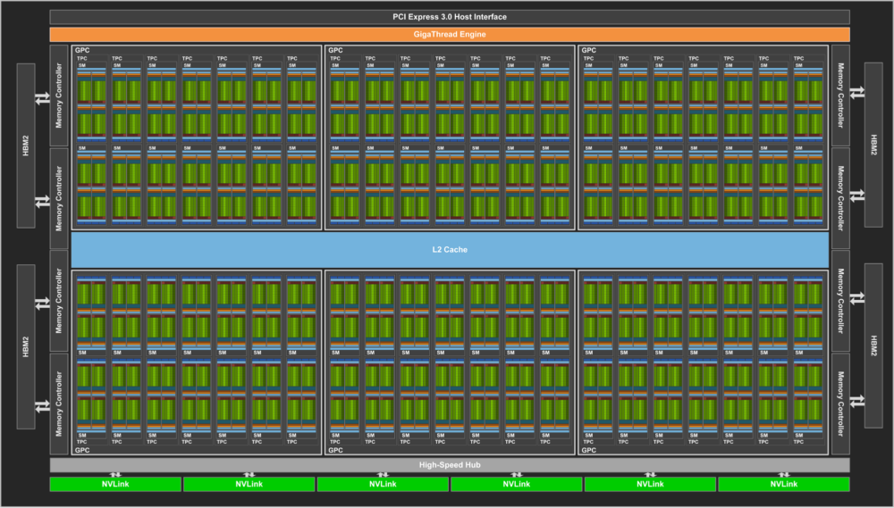

## 为什么用GPU？

图中所示的是CPU和GPU的架构。CPU的设计是为了处理串行操作（sequential operations）, GPU则是用来处理并行操作（parallel operations）

从图中可以看到，CPU相对GPU，由于其相对较多的控制流，所以其读取内存的延迟（latency）较低。GPU相对CPU，拥有较多的计算单元（arithmetic logic unit）但相对较少的控制流（control flow），但其吞吐量（throughout）和带宽（memory bandwidth）大。

>>e.g., floating-point computations, is beneficial for highly parallel computations; the GPU can hide memory access latencies with computation, instead of relying on large data caches and complex flow control to avoid long memory access latencies, both of which are expensive in terms of transistors.
--《CUDA C++ Programming Guide》

## NVIDIA GPU 架构演变

从图中可以看到，我们所用的Tesla V100 是采用Volta架构，在2017年提出。近几年，随着更新，出现了Turling和 Ampere架构。7.x表示其性能。

下面贴一张我们用到的Tesla V100 GPU 架构。其中计算单精度（Floating Point 32）的core有64个/SM，计算双精度（FP64）的core有32个/SM， 还有8个Tensor core/SM。
>> NVIDIA Volta™ 中的第一代 Tensor Core 专为深度学习而设计，通过 FP16 和 FP32 下的混合精度矩阵乘法提供了突破性的性能 – 与 NVIDIA Pascal 相比，用于训练的峰值 teraFLOPS (TFLOPS) 性能提升了高达 12 倍，用于推理的峰值 TFLOPS 性能提升了高达 6 倍。这项关键功能使 Volta 提供了比 Pascal 高 3 倍的训练和推理性能。

## CUDA基础

首先，需要了解一些常用的术语。

- Streaming Multiprocessors (SMs) - BLOCK
- Streaming Processors (SPs) - THREAD
- Synchronous DRAM (SDRAM) - Global MEM
- Graphics Double Data Rate (GDDR) - GDDR SRAMs(used for graphics)
- High-Bandwidth Memory (HBM)
- Single Instruction Multiple Data (SIMD)

从上面的Tesla V100 架构图中，我们看到很多绿色的模块被打包成了一个个SM，每个SM里包含了很多的SP。下图中，很形象的解释了Thread，Block和Grid的关系。其中threadIdx有x,y,z三个属性，因此可以描述三维。BlockIdx同理。BlockDim则描述每一Block中有多少Threads。

一般的，我们需要初始化block和thread

